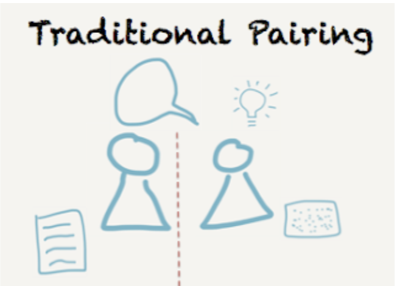

# Social Software Testing Approaches

Software teams, agile teams, in particular, are well aware of the need for their developers, testers, product owners, and other team members to collaborate. The usual selection of agile ceremonies creates space for people sharing the planning of the work: planning meetings, product backlog refinement meetings, three amigos sessions for coming up with acceptance examples, and daily meetings just to mention a few. For much of the rest of the time, people are hunched over their own keyboards and screens, working on their own tasks – more so in the time of remote work. Even if developers work with each other doing pair programming, testers often work on their own.

What if, instead of sitting in meetings to create a shared understanding, we recognized that a lot of the understanding gets created while the work is being done? Accepting this would drive us to seek approaches to do the work together, and move us from co-creation, in a flow of tasks mutually agreed, to continuous collaboration both between multiple testers and between testers and other roles. This is what I call social software testing approaches. I want us to test together, not only talk about testing together!

Social software testing approaches are recipes testers can adopt in order to work together and improve their testing by contributing to the work and simultaneously learning about the work. The testing work done in a social frame could be exploring a new feature, applying a test technique, creating test automation to document core flows or reviewing and testing software as it is being written through bringing your own perspectives to writing it.

These recipes pertain to a pair (traditional and strong-style pair testing) or to a group (ensemble testing and bug bash).

When doing social activities a physical space is a common go-to, yet these activities work well as virtual over a video call. Embracing the virtual also enables us to expand these from our own colleagues to the community at large, doing a Community Testing Tour to learn more, working with other software professionals connected through social media and online courses.

## From Planning to Doing - Together

Social Software Testing approaches call for a change in how we think about planning and doing the work. These techniques of doing the work instead of planning the work in a social frame encourage getting the best of multiple people into the work as it is being done, instead of optimizing for getting most of the work done separately, risking rework with feedback coming in later.

Planning together isn’t the same thing as doing together. Planning together optimizes the work with the idea that when we first create a common understanding, we can effectively work individually. Doing together we know best through pair programming, and it optimizes the work with the idea that in knowledge work, a lot of the relevant learning happens when we are doing the work. No plan survives the action without adaptation. No learning can be transferred through a document, even if the document can be a helpful starting point for someone starting to learn an area they haven’t worked with.

For doing together, there is more than one person doing the work, and learning more while doing. The social frame of doing the work makes sense. Even if it is not getting the most out of us, it gets the best out of us into the deliverable we are working in and can help avoid rework. Instead of going back later to review and confirm the correctness of the result, we can co-generate the options and choose something that works in practice (shown through doing) over a theory (written in a plan). We avoid the ping pong, we generate ideas bouncing off one another we would not come to alone, and we sharpen our knowledge and skills learning in the context of doing the work.

## The Options for Doing Together

To do testing together, a few things should be in place. We should have something to test, people to do the testing with, and a specific social software testing approach to apply. We could be testing a unit of code or a fully integrated version of a system. For the testing to be in the frame of social, there should be a minimum of two people (pair) up to whatever number (group).

### Pair or Group?

In a pair, you’d expect two people engaged in the work. Two is more than one and a definite upgrade from solo work, but in a pair, both people need to be always on. When one needs a break, both take a break from the paired work. Sometimes people don’t connect too well and may need to exert a high level of energy into the collaboration, even if the connection can be significantly improved through focused work on empathy and understanding power dynamics.

A group is more than two. It is a higher level of investment into sharing knowledge, but it also enables someone to step out of the group to take a break, and rejoin later. It often appears that people are on their best behavior in a group, avoiding some of the difficult pair dynamics by design.

The power dynamic in play shows particularly well when you have people with different levels of experience (junior and senior) or from different functional disciplines (tester and developer). In a pair, there can be only one of each. In a group, we can significantly change dynamics with the numbers of representatives. Also, for three amigos to really work together (tester, developer, and business analyst), we are already past a pair needing more perspectives into the collaborative work we are doing.

For a pair, you can apply a promiscuous pattern, meaning rotation of pairs. This enables everyone to work with everyone. Yet a lot of times in a pair programming organization, testers report that they are left out of the pairs and could benefit from the group setting to join as a third in addition to the pair.

### Traditional Pair Testing

In traditional pair testing, we give the work to a pair. The pair divides into roles of driver and navigator, and agree on how they switch the roles. The driver sits in front of the keyboard, having control over typing. As the pair works, conversation guides what gets typed, and the navigator can continuously review the work artifact created. While the driver controls the testing on the keyboard, the navigator often keeps notes of what is going on.

Traditional pair testing can work great when there is a high level of trust and a great connection between the two people. A common problem people report from this type of pairing is that all the control is on the driver, and pairing can become watching the other type and explain. To keep the work energetic, switching the keyboard after completing work from one idea, getting both people in the pair to take turns on the keyboard, is a good practice.

”On keyboard” is a little more for tactical focus, whereas “off keyboard” is a little more of strategic focus reverse engineered from mutual agreements and observed actions. Thinking out loud is an important part, as very little testing happens on the keyboard. Rather, testing is an activity using the application as an external imagination to find possible problems and the engaged tester plays a central role. To get your own idea worked through in the pair, you typically take the keyboard, and explain as you go.

### Strong-Style Pair Testing

In strong-style pair testing, we still give the work to a driver-navigator pair, with the driver’s hands on the keyboard and an agreement of rotating roles in the pair. The rules of communication are different though. By introducing a rule that any idea must go through both people in the pair, ideas must be spoken out loud to be typed in by the other person.

The driver on the keyboard is not only obeying commands but reviewing the work going through them. While trusting that one’s navigator is good, speaking back, confirming ideas, and filling in the blanks in mutual understanding is welcome. When navigating in such a pair, we start from intent (“what should we get done”), and using things happening at the keyboard as feedback, we can then drill down to pointing where to start, conceptual instructions or step by step instructions.

The notes are common, and the connection between the pair is enforced with the communication rule. This style becomes particularly important when working across experience levels or functional disciplines, as it strips away the idea that the more powerful one is on the keyboard by default.

With strong-style pair testing, tactical focus is shared, whereas strategic focus is placed with the navigator. This frees the person on the keyboard to pay attention to the details of operating the tools of the trade. Instead of thinking out loud, the driver focuses on listening and translating ideas into action. To get your own idea worked through in the pair, you pass the keyboard to the pair and take the navigator role.

### Ensemble Testing

Ensemble testing scales the strong-style pairing to a group. Using the communication rule that whoever is on the keyboard isn’t allowed to be the source of the idea of what to do next, ideas must come from the group of navigators. Often the groups use a pattern of a designated navigator who channels the group, and roles rotate frequently.

The distinction in scaling up strong-style over traditional pairing becomes evident when the group grows. Holding the idea of what we are doing with the group keeps people engaged, whereas watching someone else do and explain does not create the same kind of connection for multiple people.

Ensemble testing puts people together on the same task, in the same space, at the same time and on the same computer. If testing tasks require multiple input devices, they are still all controlled from the group of navigators orchestrating the testing using their words.

### Bug Bashes

Bug Bashes are a tester community go-to mechanism for group sessions with the intent of finding problems with multiple people engaged in testing. In a bug bash, we prepare a session for solo or pair testing to happen in the same space at the same time, but not all on the same computer engaged in one testing activity, but a group of themed testing activities.

A typical use of a bug bash is to collect and share issues in an end to end scenario, or to accept a new feature by ensuring everyone from the team takes their time in trying it out in a coordinated fashion where results from multiple perspectives get to cross-pollinate and change people’s perspectives.

It focuses more on sharing the results of testing and leveraging the energy of the group when ensemble testing focuses more on getting everyone to contribute to the same task at hand.

## Making Your Choices

While there are organizations that do pair testing (and pair programming) or ensemble testing (or ensemble programming) full time, most of us may benefit from these social software testing approaches as a spice to create a more versatile test strategy.

| Approach                    | Best Used For                                                       |
| --------------------------- | ------------------------------------------------------------------- |
| Traditional Pair Testing    | Working together in an equal pair requiring little rule assistance. |
| Strong-style Pair Testing   | Working together in an unequal pair.                                |
| Ensemble Testing            | Learning and innovating a shared way of working.                    |
| Bug Bashes                  | Seeing problems from many perspectives.                             |

There’s a lot of variation you can introduce to these basic recipes, and we encourage you to do so – whatever you do, make it work for you.

The social software testing approaches are great for:

  * Larger organizations where functional silos continue to exist (Testers get together to test)

  * Agile teams where we need to share testing skills (Teams get together to test)

  * Teaching anything testing related to a group (A training group gets together to test)

  * Introducing testing perspectives to programming activities (Testers joining ensemble programming)

With my work at the office, I use these techniques to break out of both team and functional silos. And I know of no better way to learn more practical tips on testing than to get together a group and observe while working together. People don’t know what they don’t know, but they notice what they did not know in the context of seeing someone else doing it.

## Taking Social Software Testing Approaches on a Tour

In addition to learning within your team, you can extend from learning within the team to the community at large: community testing tours applying these approaches give you hands on experiences working with others even in other companies.

I learned the practice of these approaches in pairs and groups of testers and developers across the world. Back then, as the only tester amongst 20 developers, I needed the social frame to learn from my peers. Calling out in social media (Twitter and Slack communities), I found people willing to practice with me. Pair testing with people later started a whole movement of Testing Tours where people call out for doing testing practice together, online, and blog about it. I have had the pleasure of being an early stop for multiple people systematically learning from one another. These Testing Tours are about meeting to learn together, and on some of them people may apply testing tours, the test technique, to illustrate taking perspectives on application.

None of this new style of deep, serendipitous learning would be possible without the social software testing approaches. They may not come easy at first, but they are skills you can practice on.